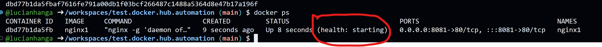

# test.docker.hub.automation

Playground for testing for automation of building docker images and upload to git.hub registry.

## To get it started:

### requirements

- create 3 images for nginx with different landing pages
- create one reverse proxy image with nginx
- based on the location header of the request, the reverse proxy should forward the request to the correct nginx image
- create a docker-compose file to start the reverse proxy and the 3 nginx images
- run the docker-compose file on a local swarm cluster

### development & deployment & testing

#### create 3 images for nginx with different landing pages

create the folders for the 3 nginx images

```bash
mkdir -p nginx1 nginx2 nginx3
```
create the Dockerfile for the 3 nginx images

```bash
cat <<EOF > nginx1/Dockerfile
FROM nginx:1.17.10-alpine
COPY nginx1.html /usr/share/nginx/html/index.html
EOF
```
create the nginx1.html file

```bash
cat <<EOF > nginx1/nginx1.html
<html>
<head>
<title>nginx1</title>
</head>
<body>
<h1>nginx1</h1>
</body>
</html>
EOF
```

test the code by creating the image and runing it locally on port 8081 and see if the correct landing page is shown

```bash
docker image build -t nginx1 nginx1

# see if the image is created
docker image ls

# run the image locally on port 8081
docker container run \
    --detach \
    --name nginx1 \
    --publish 8081:80 \
    nginx1

# check if the container is running
docker container ls

# check if the landing page is shown
curl localhost:8081

# cleanup for nginx1
docker container stop nginx1
docker container rm nginx1
docker image rm nginx1
```

start the same container with health check

```bash
docker container run \
    --detach \
    --name nginx1 \
    --publish 8081:80 \
    --health-cmd="curl -f http://localhost/ || exit 1" \
    --health-interval=5s \
    --health-retries=3 \
    --health-timeout=2s \
    --health-start-period=5s \
    nginx1
```

picture of the running container:



repeate the same steps for nginx2 and nginx3 or just copy and modify the files

